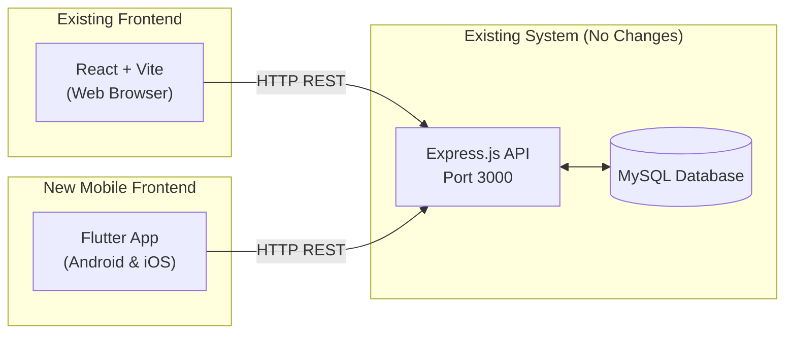
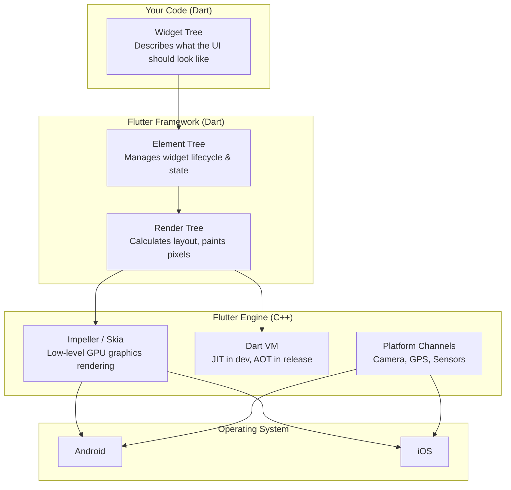
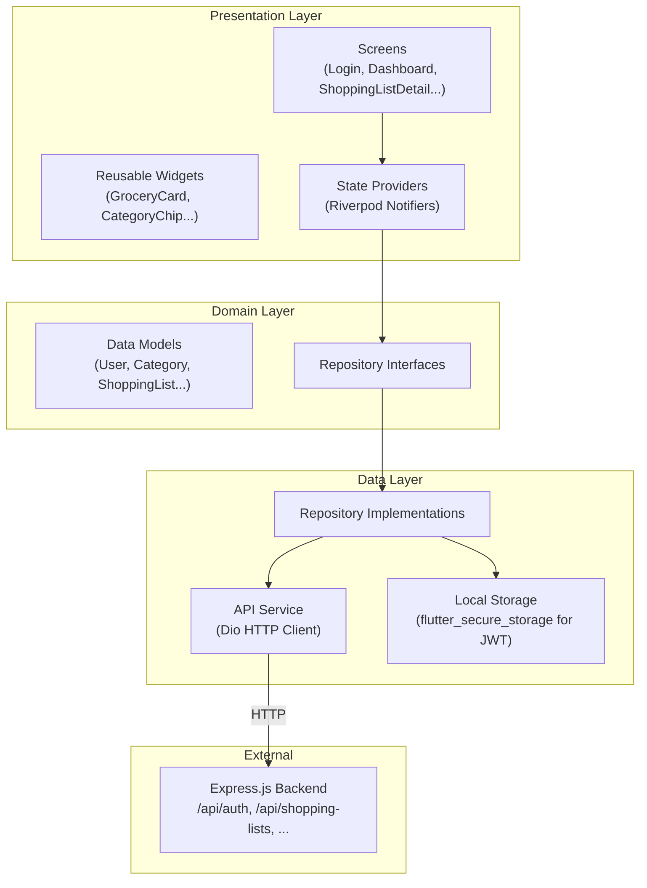
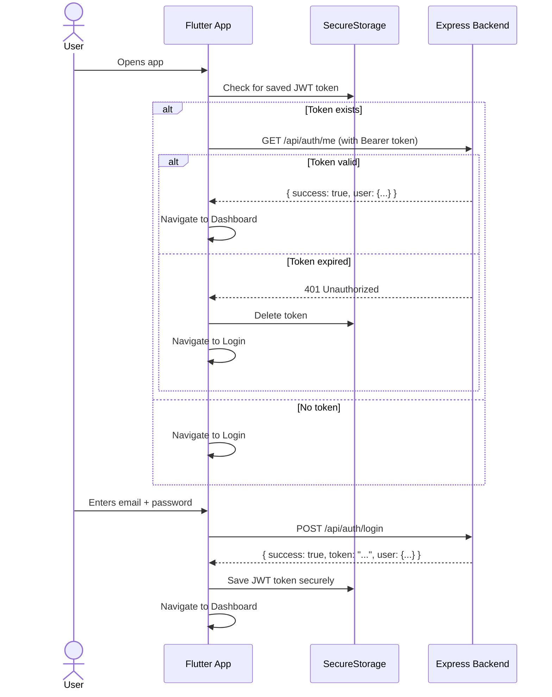
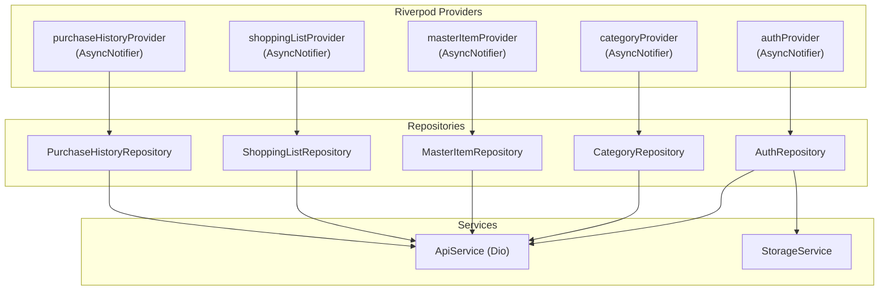
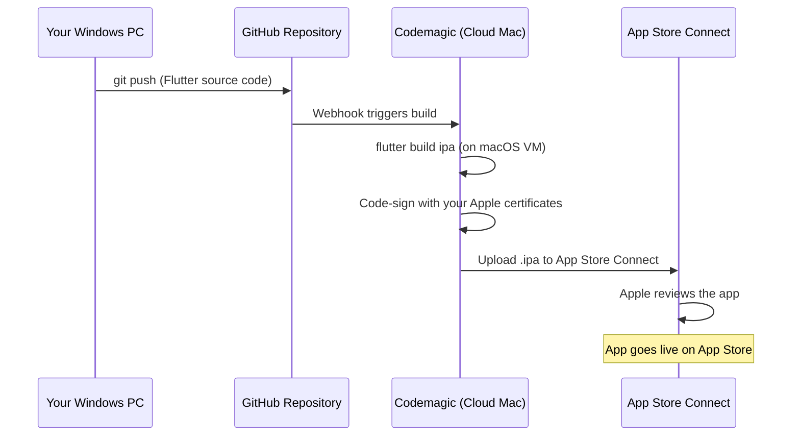

# Smart Grocery — Flutter Mobile App Development Guide

> **Audience**: A Windows developer building a cross-platform (Android + iOS) mobile variant of the existing Smart Grocery web app.
> **Existing Backend**: Express.js + MySQL (already deployed or deployable separately). The Flutter app will consume the same REST API.

---

## Table of Contents

1. [System Overview & How the Pieces Fit](#1-system-overview--how-the-pieces-fit)
2. [Environment Setup on Windows](#2-environment-setup-on-windows)
3. [Flutter Architecture Deep-Dive](#3-flutter-architecture-deep-dive)
4. [Project Structure & Folder Layout](#4-project-structure--folder-layout)
5. [Data Models (Dart)](#5-data-models-dart)
6. [API Service Layer](#6-api-service-layer)
7. [Authentication Flow](#7-authentication-flow)
8. [State Management (Riverpod)](#8-state-management-riverpod)
9. [Navigation & Routing](#9-navigation--routing)
10. [Screen-by-Screen Implementation Plan](#10-screen-by-screen-implementation-plan)
11. [Android Studio Workflow](#11-android-studio-workflow)
12. [Building & Deploying to Google Play Store](#12-building--deploying-to-google-play-store)
13. [Building & Deploying to Apple App Store (from Windows)](#13-building--deploying-to-apple-app-store-from-windows)
14. [Testing Strategy](#14-testing-strategy)

---

## 1. System Overview & How the Pieces Fit

Your existing system is a web app with a React frontend talking to an Express + MySQL backend. The Flutter mobile app will **replace only the frontend**. Your backend stays exactly as it is.



> [!IMPORTANT]
> The Flutter app and the React web app can both run simultaneously, consuming the same API. No backend changes are required.

---

## 2. Environment Setup on Windows

### Step 1: Install Flutter SDK

1.  Download the Flutter SDK from [flutter.dev/docs/get-started/install/windows](https://docs.flutter.dev/get-started/install/windows/mobile).
2.  Extract the `.zip` file to a permanent location, e.g., `C:\flutter`.
3.  Add `C:\flutter\bin` to your Windows **PATH** environment variable:
    *   Search for "Environment Variables" in the Start Menu.
    *   Under "User variables", edit `Path` and add `C:\flutter\bin`.
4.  Open a **new** terminal and verify: `flutter --version`.

### Step 2: Install Android Studio

1.  Download and install [Android Studio](https://developer.android.com/studio).
2.  During setup, ensure these are checked:
    *   ✅ Android SDK
    *   ✅ Android SDK Command-line Tools
    *   ✅ Android SDK Build-Tools
    *   ✅ Android Emulator
3.  After installation, open Android Studio → **Settings** → **Plugins** → Search for and install the **Flutter** plugin (this also installs the Dart plugin).
4.  Accept Android licenses from terminal:
    ```bash
    flutter doctor --android-licenses
    ```

### Step 3: Create an Android Emulator

1.  In Android Studio → **Tools** → **Device Manager** → **Create Virtual Device**.
2.  Select a device (e.g., **Pixel 7**).
3.  Download a system image (e.g., **API 34 — Android 14**).
4.  Finish. Launch the emulator to confirm it boots.

### Step 4: Install VS Code Extensions (Optional Secondary IDE)

1.  Install the **Flutter** extension (by Dart Code) in VS Code.
2.  Install the **Dart** extension.
3.  You can now run Flutter apps from VS Code with `F5` or the terminal.

### Step 5: Verify Everything

```bash
flutter doctor
```

You should see green checkmarks (✅) for Flutter, Android toolchain, and Android Studio. The Xcode/iOS line will show an ✗ — that is expected on Windows.

---

## 3. Flutter Architecture Deep-Dive

### 3.1 How Flutter Renders UI (Engine Level)

Unlike React Native (which maps to native OS widgets), Flutter **draws every pixel itself** using a C++ graphics engine. This means your UI looks identical on Android and iOS.



### 3.2 Application Architecture (Clean Architecture)

The Flutter app will follow a layered architecture to keep code organized and testable:



---

## 4. Project Structure & Folder Layout

After creating your project with `flutter create smart_grocery_mobile`, organize the `lib/` folder like this:

```
smart_grocery_mobile/
├── android/                    # Native Android project (managed by Android Studio)
├── ios/                        # Native iOS project (compiled in the cloud)
├── lib/
│   ├── main.dart               # App entry point
│   ├── app.dart                # MaterialApp, theme, router setup
│   │
│   ├── core/
│   │   ├── constants.dart      # API base URL, app-wide constants
│   │   ├── theme.dart          # App theme (colors, typography, dark mode)
│   │   └── router.dart         # GoRouter route definitions
│   │
│   ├── models/
│   │   ├── user.dart
│   │   ├── category.dart
│   │   ├── master_item.dart
│   │   ├── shopping_list.dart
│   │   ├── shopping_list_item.dart
│   │   └── purchase_history.dart
│   │
│   ├── services/
│   │   ├── api_service.dart    # Dio client, interceptors, base URL
│   │   ├── auth_service.dart   # Login, register, token storage
│   │   └── storage_service.dart # Secure local storage wrapper
│   │
│   ├── repositories/
│   │   ├── auth_repository.dart
│   │   ├── category_repository.dart
│   │   ├── master_item_repository.dart
│   │   ├── shopping_list_repository.dart
│   │   └── purchase_history_repository.dart
│   │
│   ├── providers/
│   │   ├── auth_provider.dart
│   │   ├── category_provider.dart
│   │   ├── master_item_provider.dart
│   │   ├── shopping_list_provider.dart
│   │   └── purchase_history_provider.dart
│   │
│   ├── screens/
│   │   ├── auth/
│   │   │   ├── login_screen.dart
│   │   │   └── register_screen.dart
│   │   ├── dashboard/
│   │   │   └── dashboard_screen.dart
│   │   ├── categories/
│   │   │   └── categories_screen.dart
│   │   ├── master_items/
│   │   │   └── master_items_screen.dart
│   │   ├── shopping_lists/
│   │   │   ├── shopping_lists_screen.dart
│   │   │   └── shopping_list_detail_screen.dart
│   │   ├── purchase_history/
│   │   │   └── purchase_history_screen.dart
│   │   └── settings/
│   │       └── settings_screen.dart
│   │
│   └── widgets/
│       ├── app_drawer.dart     # Side navigation drawer
│       ├── grocery_card.dart
│       ├── category_chip.dart
│       ├── empty_state.dart
│       └── loading_indicator.dart
│
├── pubspec.yaml                # Dependencies
└── test/                       # Unit & widget tests
```

---

## 5. Data Models (Dart)

These Dart classes mirror your existing MySQL tables and the JSON responses from your Express API.

### User
```dart
class User {
  final int id;
  final String name;
  final String email;

  User({required this.id, required this.name, required this.email});

  factory User.fromJson(Map<String, dynamic> json) => User(
    id: json['id'],
    name: json['name'],
    email: json['email'],
  );
}
```

### Category
```dart
class Category {
  final int id;
  final String categoryName;
  final int? createdBy;

  Category({required this.id, required this.categoryName, this.createdBy});

  factory Category.fromJson(Map<String, dynamic> json) => Category(
    id: json['id'],
    categoryName: json['category_name'],
    createdBy: json['created_by'],
  );
}
```

### MasterItem
```dart
class MasterItem {
  final int id;
  final String itemName;
  final int categoryId;
  final String unit;
  final double defaultQuantity;
  final String? categoryName; // Joined from categories table

  MasterItem({
    required this.id,
    required this.itemName,
    required this.categoryId,
    required this.unit,
    required this.defaultQuantity,
    this.categoryName,
  });

  factory MasterItem.fromJson(Map<String, dynamic> json) => MasterItem(
    id: json['id'],
    itemName: json['item_name'],
    categoryId: json['category_id'],
    unit: json['unit'] ?? 'pcs',
    defaultQuantity: (json['default_quantity'] ?? 1).toDouble(),
    categoryName: json['category_name'],
  );
}
```

### ShoppingList
```dart
class ShoppingList {
  final int id;
  final String listName;
  final int userId;
  final String status; // 'Pending' | 'Completed'
  final String createdAt;
  final int itemCount;
  final List<ShoppingListItem>? items;

  ShoppingList({
    required this.id,
    required this.listName,
    required this.userId,
    required this.status,
    required this.createdAt,
    this.itemCount = 0,
    this.items,
  });

  factory ShoppingList.fromJson(Map<String, dynamic> json) => ShoppingList(
    id: json['id'],
    listName: json['list_name'],
    userId: json['user_id'],
    status: json['status'] ?? 'Pending',
    createdAt: json['created_at'],
    itemCount: json['item_count'] ?? 0,
    items: json['items'] != null
        ? (json['items'] as List).map((i) => ShoppingListItem.fromJson(i)).toList()
        : null,
  );
}
```

### ShoppingListItem
```dart
class ShoppingListItem {
  final int id;
  final int shoppingListId;
  final int masterItemId;
  final double quantity;
  final String unit;
  final String priority; // 'High' | 'Medium' | 'Low'
  final String? notes;
  final bool purchased;
  final String? itemName;      // Joined
  final String? categoryName;  // Joined

  ShoppingListItem({
    required this.id,
    required this.shoppingListId,
    required this.masterItemId,
    required this.quantity,
    required this.unit,
    required this.priority,
    this.notes,
    required this.purchased,
    this.itemName,
    this.categoryName,
  });

  factory ShoppingListItem.fromJson(Map<String, dynamic> json) => ShoppingListItem(
    id: json['id'],
    shoppingListId: json['shopping_list_id'],
    masterItemId: json['master_item_id'],
    quantity: (json['quantity'] ?? 1).toDouble(),
    unit: json['unit'] ?? 'pcs',
    priority: json['priority'] ?? 'Medium',
    notes: json['notes'],
    purchased: json['purchased'] == 1 || json['purchased'] == true,
    itemName: json['item_name'],
    categoryName: json['category_name'],
  );
}
```

### PurchaseHistory
```dart
class PurchaseHistory {
  final int id;
  final int shoppingListId;
  final int userId;
  final int totalItems;
  final double totalSpent;
  final String completedDate;
  final String? listName; // Joined

  PurchaseHistory({
    required this.id,
    required this.shoppingListId,
    required this.userId,
    required this.totalItems,
    required this.totalSpent,
    required this.completedDate,
    this.listName,
  });

  factory PurchaseHistory.fromJson(Map<String, dynamic> json) => PurchaseHistory(
    id: json['id'],
    shoppingListId: json['shopping_list_id'],
    userId: json['user_id'],
    totalItems: json['total_items'],
    totalSpent: (json['total_spent'] ?? 0).toDouble(),
    completedDate: json['completed_date'],
    listName: json['list_name'],
  );
}
```

---

## 6. API Service Layer

The API service uses the `dio` package to make HTTP calls to your existing Express backend. An interceptor automatically injects the JWT token into every request.

### API Endpoint Map

This table maps every Flutter repository method to the existing Express route it consumes:

| Flutter Method | HTTP | Backend Route | Auth? |
|---|---|---|---|
| `register(name, email, password)` | `POST` | `/api/auth/register` | ❌ |
| `login(email, password)` | `POST` | `/api/auth/login` | ❌ |
| `getMe()` | `GET` | `/api/auth/me` | ✅ |
| `getCategories()` | `GET` | `/api/categories` | ✅ |
| `createCategory(name)` | `POST` | `/api/categories` | ✅ |
| `getMasterItems()` | `GET` | `/api/master-items` | ✅ |
| `createMasterItem(...)` | `POST` | `/api/master-items` | ✅ |
| `getShoppingLists()` | `GET` | `/api/shopping-lists` | ✅ |
| `createShoppingList(name)` | `POST` | `/api/shopping-lists` | ✅ |
| `getShoppingListDetail(id)` | `GET` | `/api/shopping-lists/:id` | ✅ |
| `addItemToList(listId, ...)` | `POST` | `/api/shopping-lists/:id/items` | ✅ |
| `updateListItem(listId, itemId, ...)` | `PUT` | `/api/shopping-lists/:id/items/:itemId` | ✅ |
| `deleteListItem(listId, itemId)` | `DELETE` | `/api/shopping-lists/:id/items/:itemId` | ✅ |
| `completeList(id, totalSpent)` | `POST` | `/api/shopping-lists/:id/complete` | ✅ |
| `getPurchaseHistory()` | `GET` | `/api/purchase-history` | ✅ |

### Dio Client Setup (Conceptual)
```dart
// services/api_service.dart
import 'package:dio/dio.dart';
import 'storage_service.dart';

class ApiService {
  late final Dio _dio;

  ApiService() {
    _dio = Dio(BaseOptions(
      baseUrl: 'https://your-backend-url.com/api', // Your deployed Express API
      connectTimeout: const Duration(seconds: 10),
      receiveTimeout: const Duration(seconds: 10),
      headers: {'Content-Type': 'application/json'},
    ));

    // Interceptor: Auto-attach JWT token to every request
    _dio.interceptors.add(InterceptorsWrapper(
      onRequest: (options, handler) async {
        final token = await StorageService.getToken();
        if (token != null) {
          options.headers['Authorization'] = 'Bearer $token';
        }
        handler.next(options);
      },
      onError: (error, handler) {
        if (error.response?.statusCode == 401) {
          // Token expired — redirect to login
          StorageService.clearToken();
          // Navigate to login screen
        }
        handler.next(error);
      },
    ));
  }

  Future<Response> get(String path) => _dio.get(path);
  Future<Response> post(String path, {dynamic data}) => _dio.post(path, data: data);
  Future<Response> put(String path, {dynamic data}) => _dio.put(path, data: data);
  Future<Response> delete(String path) => _dio.delete(path);
}
```

---

## 7. Authentication Flow



---

## 8. State Management (Riverpod)

Use `flutter_riverpod` for managing app state. Each domain has its own provider.



---

## 9. Navigation & Routing

Use the `go_router` package for declarative routing with authentication guards.

| Route Path | Screen | Auth Required? |
|---|---|---|
| `/login` | Login Screen | ❌ |
| `/register` | Register Screen | ❌ |
| `/dashboard` | Dashboard | ✅ |
| `/categories` | Categories | ✅ |
| `/master-items` | Master Items | ✅ |
| `/shopping-lists` | Shopping Lists | ✅ |
| `/shopping-lists/:id` | Shopping List Detail | ✅ |
| `/purchase-history` | Purchase History | ✅ |
| `/settings` | Settings | ✅ |

The router will use a `redirect` function that checks for a valid auth token. If no token exists and the user tries to access a protected route, they are automatically redirected to `/login`.

---

## 10. Screen-by-Screen Implementation Plan

Below is a mapping from your existing React pages to their Flutter equivalents:

| React Page | Flutter Screen | Key Flutter Widgets |
|---|---|---|
| `Auth.tsx` | `LoginScreen` / `RegisterScreen` | `TextFormField`, `ElevatedButton`, `Form` |
| `Dashboard.tsx` | `DashboardScreen` | `Card`, `GridView`, `ListTile` |
| `Categories.tsx` | `CategoriesScreen` | `ListView`, `AlertDialog` (for add/edit) |
| `MasterItems.tsx` | `MasterItemsScreen` | `ListView`, `SearchBar`, `DropdownButton` |
| `ShoppingLists.tsx` | `ShoppingListsScreen` | `ListView`, `FloatingActionButton`, `Chip` |
| `ShoppingListDetail.tsx` | `ShoppingListDetailScreen` | `CheckboxListTile`, `Dismissible` (swipe to delete) |
| `PurchaseHistory.tsx` | `PurchaseHistoryScreen` | `ListView`, `ExpansionTile` |
| `Settings.tsx` | `SettingsScreen` | `SwitchListTile`, `ListTile` |

### Mobile-Specific Enhancements
These features go beyond the web app and take advantage of mobile capabilities:

*   **Pull-to-Refresh**: On all list screens using `RefreshIndicator`.
*   **Swipe Actions**: Swipe-to-delete or swipe-to-mark-purchased using `Dismissible`.
*   **Bottom Navigation Bar**: Replace the web sidebar with a mobile `BottomNavigationBar`.
*   **Haptic Feedback**: Subtle vibrations when toggling item checkboxes.
*   **Offline Caching** (future): Cache data locally with `sqflite` or `Hive` for offline grocery shopping.

---

## 11. Android Studio Workflow

Here is your day-to-day workflow using Android Studio as the primary IDE.

### 11.1 Creating the Flutter Project

1.  Open **Android Studio**.
2.  **File** → **New** → **New Flutter Project**.
3.  Select **Flutter** on the left pane. Set the Flutter SDK path to `C:\flutter`.
4.  Enter the project name: `smart_grocery_mobile`.
5.  Set the project location (e.g., `D:\Development\smart_grocery_mobile`).
6.  Select **Kotlin** for Android and **Swift** for iOS.
7.  Click **Finish**.

### 11.2 Running & Debugging

1.  Launch your Android Emulator from the **Device Manager** toolbar dropdown.
2.  Click the green **Run ▶** button or press `Shift + F10`.
3.  Use **Hot Reload** (`Ctrl+\` or the ⚡ button) for instant UI updates.
4.  Use **Hot Restart** (`Ctrl+Shift+\`) to reset app state.

### 11.3 Installing Dependencies

Edit `pubspec.yaml` and add these essential packages:

```yaml
dependencies:
  flutter:
    sdk: flutter

  # State Management
  flutter_riverpod: ^2.5.1
  riverpod_annotation: ^2.3.5

  # Networking
  dio: ^5.4.3

  # Routing
  go_router: ^14.2.0

  # Secure Storage (for JWT)
  flutter_secure_storage: ^9.2.2

  # UI Enhancements
  google_fonts: ^6.2.1
  flutter_animate: ^4.5.0
  shimmer: ^3.0.0           # Loading skeleton effects

  # Utilities
  intl: ^0.19.0              # Date formatting
  cached_network_image: ^3.3.1

dev_dependencies:
  flutter_test:
    sdk: flutter
  flutter_lints: ^4.0.0
  riverpod_generator: ^2.4.0
  build_runner: ^2.4.9
```

Run `flutter pub get` in the terminal (or click the "Pub get" button in Android Studio).

---

## 12. Building & Deploying to Google Play Store

This is done entirely on your Windows machine.

### Step 1: Create a Signing Key

```bash
keytool -genkeypair -v -keystore D:\keys\upload-keystore.jks -storetype JKS -keyalg RSA -keysize 2048 -validity 10000 -alias upload
```

### Step 2: Configure Signing in Gradle

Create the file `android/key.properties`:
```properties
storePassword=your_password
keyPassword=your_password
keyAlias=upload
storeFile=D:\\keys\\upload-keystore.jks
```

Edit `android/app/build.gradle` to load the key properties and configure the release signing config.

### Step 3: Build the Release App Bundle

```bash
flutter build appbundle --release
```

Output: `build\app\outputs\bundle\release\app-release.aab`

### Step 4: Upload to Google Play Console

1.  Go to [play.google.com/console](https://play.google.com/console) and pay the one-time $25 registration fee.
2.  Create a new app → Fill in app details.
3.  Navigate to **Production** → **Create new release** → Upload your `.aab` file.
4.  Fill out all required sections:
    *   Store listing (title, description, screenshots)
    *   Content rating questionnaire
    *   Privacy policy URL
    *   Target audience
5.  Submit for review. Google typically reviews within 1–3 days.

---

## 13. Building & Deploying to Apple App Store (from Windows)

Since you are on Windows, you **cannot** compile an iOS app locally. You will use **Codemagic**, a CI/CD service designed for Flutter.



### Step 1: Apple Developer Account
Pay the $99/year fee at [developer.apple.com](https://developer.apple.com).

### Step 2: Push Code to GitHub
```bash
git init
git add .
git commit -m "Initial Flutter project"
git remote add origin https://github.com/yourname/smart-grocery-mobile.git
git push -u origin main
```

### Step 3: Set Up Codemagic

1.  Go to [codemagic.io](https://codemagic.io) and sign up (free tier includes 500 build minutes/month).
2.  Connect your GitHub repository.
3.  Select **Flutter App** as the project type.
4.  In **iOS code signing settings**, link your Apple Developer Account. Codemagic will automatically manage certificates and provisioning profiles.
5.  Configure the build to:
    *   Run `flutter build ipa`
    *   Publish directly to App Store Connect

### Step 4: Trigger a Build
Click **Start new build** in Codemagic. It will:
1.  Spin up a macOS virtual machine.
2.  Clone your repo from GitHub.
3.  Run `flutter build ipa --release`.
4.  Sign the app with your Apple certificate.
5.  Upload the `.ipa` to App Store Connect.

### Step 5: Submit for Apple Review
1.  Log in to [appstoreconnect.apple.com](https://appstoreconnect.apple.com) from your browser.
2.  Select your app → add screenshots, description, and age rating.
3.  Select the build uploaded by Codemagic.
4.  Submit for review (typically 1–2 days).

---

## 14. Testing Strategy

### Unit Tests
Test your models, repositories, and business logic:
```bash
flutter test
```

### Widget Tests
Test individual screens and widgets for correct rendering:
```bash
flutter test test/widgets/
```

### Integration Tests
Test full user flows (login → create list → add items → checkout):
```bash
flutter test integration_test/
```

### Manual Testing
*   **Android**: Use Android Studio's emulator or plug in a physical Android phone via USB.
*   **iOS**: Use Codemagic to build a TestFlight version. Install it on a physical iPhone and test manually.

---

> [!TIP]
> **Quick Reference: Key Commands**
> | Command | Purpose |
> |---|---|
> | `flutter create smart_grocery_mobile` | Create new project |
> | `flutter pub get` | Install dependencies |
> | `flutter run` | Run on connected device/emulator |
> | `flutter build appbundle --release` | Build Android release (.aab) |
> | `flutter build apk --release` | Build Android release (.apk) |
> | `flutter doctor` | Check environment health |
> | `flutter clean` | Clear build cache |
> | `flutter test` | Run all tests |

> [!IMPORTANT]
> **Cost Summary**
> | Item | Cost |
> |---|---|
> | Flutter SDK | Free |
> | Android Studio | Free |
> | VS Code | Free |
> | Google Play Developer | $25 (one-time) |
> | Apple Developer Program | $99/year |
> | Codemagic (iOS builds) | Free tier: 500 min/month |
